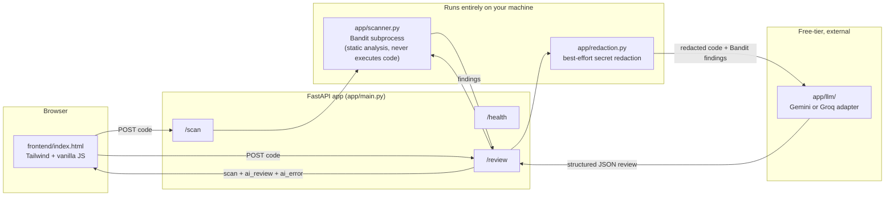

# AI Code Review & Security Sentinel

A local-first code review tool that pairs a deterministic security
scanner (Bandit) with a free-tier LLM review, behind a small FastAPI
service and a single-file dashboard. Paste Python, get back static-
analysis findings and an AI explanation with suggested fixes — side by
side, not as two disconnected tools.

**Cost to build, run, and test: $0.** No credit card anywhere in this
setup. The only accounts involved are free developer accounts (Google AI
Studio or Groq), and the full test suite runs completely offline with no
API key at all.

---

## The problem this solves

Static analyzers like Bandit are fast, free, and deterministic — but
their output is a rule ID and a terse message. They don't explain *why*
something is dangerous in a way a junior developer immediately
internalizes, and they only catch patterns someone already wrote a rule
for. LLM code review, on the other hand, reads naturally but hallucinates
line numbers, misses obvious injection bugs a regex would catch instantly,
and (on a paid API) costs money per request — a real barrier for a
student, a side project, or a portfolio piece.

This project runs both, together, for free: Bandit's findings are
ground truth handed to the model as context, so the AI review adds
plain-English explanations and concrete fixes on top of — never instead
of — deterministic static analysis. If the AI call fails for any reason,
the Bandit results still come back. Nothing about the core value depends
on a paid service staying up.

## Screenshots

*(Space intentionally left for you to fill in — see the
[screenshot checklist](#screenshot--demo-checklist) below. Recommended:
drop PNGs into a `docs/screenshots/` folder and reference them here,
e.g. ``.)*

## Architecture



If the diagram above doesn't render (e.g. you're reading this outside
GitHub), here's the same flow as text:

```
Dashboard (frontend/index.html)
    │
    ├─ POST /scan ──────► Bandit subprocess (local, static-only) ──► findings
    │
    └─ POST /review
           │
           ├─► Bandit subprocess (local) ──────────────────► findings
           │
           └─► redact_secrets(code) ──► Gemini or Groq API ──► structured
                                          (free tier, external)   AI review
           │
           └─► combined { scan, ai_review, ai_error, redactions } ──► Dashboard
```

**Design principle that shapes the whole thing:** the local half (Bandit)
is always free and always trustworthy — it never depends on anything
outside your machine. The external half (the LLM call) is the one thing
that can fail for reasons outside this app's control, so `/review` is
built to degrade gracefully instead of failing outright when only the AI
half breaks. See [Security model](#security-model) below.

## Features

- **`/scan`** — local Bandit static analysis, normalized findings with
  severity, confidence, rule ID, line number, and a docs link.
- **`/review`** — the Bandit scan plus a structured AI review (summary,
  overall risk level, per-issue severity/category/explanation/suggested
  fix), from either Gemini or Groq, chosen by one environment variable.
- **Graceful degradation** — if the LLM call fails, `/review` still
  returns `200` with the Bandit scan intact and a clear `ai_error`
  string, never a hard failure for a problem outside this app's control.
- **Secret redaction** — best-effort regex redaction of obvious secret
  patterns (AWS keys, private key blocks, tokens, hardcoded
  password/API-key assignments) applied before code reaches the LLM,
  never before the local Bandit scan.
- **Local dashboard** — one HTML file, Tailwind via CDN, no build step:
  paste code, click a button, see severity-grouped results with
  suggested fixes.
- **A real test suite** — 40+ tests covering the happy path *and* the
  failure modes: Bandit missing/timing out/returning garbage, provider
  timeouts/non-2xx responses/malformed JSON (mirrored across both
  providers), oversized/blank/wrong-language input, secret redaction in
  isolation and end-to-end. All offline, no API key required.
- **Free CI** — `.github/workflows/tests.yml` runs the full suite on
  every push, at no cost, on GitHub Actions' public-repo free tier.

## Quickstart

```bash
git clone <your-repo-url>
cd ai-code-review-security-sentinel

python3 -m venv .venv
source .venv/bin/activate        # macOS/Linux; use .venv\Scripts\activate on Windows

pip install -r requirements.txt
cp .env.example .env             # optional for /scan; needed for a live /review

uvicorn app.main:app --reload --port 8000
```

Then, in a second terminal or your file manager:

```bash
open frontend/index.html         # macOS; xdg-open on Linux, start on Windows
```

Paste Python code (a vulnerable example is pre-filled) and click **Run
review**. Full walkthrough: [`DEMO_SCRIPT.md`](DEMO_SCRIPT.md).

### Getting a free LLM key (optional — only needed for a live `/review`)

- **Gemini** (default): https://aistudio.google.com/app/apikey — Google
  account, no card. Set `GEMINI_API_KEY` in `.env`.
- **Groq**: https://console.groq.com/keys — email signup, no card. Set
  `GROQ_API_KEY` in `.env` and `LLM_PROVIDER=groq`.

> **Free-tier limits change.** Rate limits, available models, and daily
> quotas for both Gemini's and Groq's free tiers are set by Google and
> Groq respectively and can change without notice. If `/review` starts
> returning an `ai_error` that mentions a rate limit or a model name that
> no longer exists, check the provider's current dashboard/docs — this
> isn't necessarily a bug in this project. `/scan` is unaffected either
> way, since it never depends on either provider.

Without a key, `/health` and `/scan` work fully, and `/review` returns
the Bandit scan with a clear `ai_error` explaining that no key is
configured — see [`demo/sample_review_response.json`](demo/sample_review_response.json)
for what a successful response looks like.

## API examples

**Health check**
```bash
curl http://127.0.0.1:8000/health
```
```json
{"status": "ok", "app": "AI Code Review & Security Sentinel", "version": "1.0.0", "environment": "development"}
```

**Scan only (no LLM call, no external dependency)**
```bash
curl -X POST http://127.0.0.1:8000/scan \
  -H "Content-Type: application/json" \
  -d '{"code": "import subprocess\ndef run(cmd):\n    subprocess.call(cmd, shell=True)", "language": "python"}'
```
```json
{
  "tool": "bandit",
  "findings": [
    {
      "rule_id": "B602",
      "rule_name": "subprocess_popen_with_shell_equals_true",
      "severity": "HIGH",
      "confidence": "HIGH",
      "line": 3,
      "message": "subprocess call with shell=True identified, security issue.",
      "more_info": "https://bandit.readthedocs.io/en/1.7.x/plugins/b602_subprocess_popen_with_shell_equals_true.html"
    }
  ],
  "issue_count": 1,
  "loc": 3
}
```

**Full review (scan + AI)**
```bash
curl -X POST http://127.0.0.1:8000/review \
  -H "Content-Type: application/json" \
  -d '{"code": "import subprocess\ndef run_backup(cmd):\n    subprocess.call(cmd, shell=True)", "language": "python"}'
```
See [`demo/sample_review_response.json`](demo/sample_review_response.json)
for a full, schema-exact example response. `/docs` (Swagger UI) has the
complete interactive contract for every field.

## Security model

Full detail in [`SECURITY.md`](SECURITY.md); the short version:

- **The submitted code is never executed** — Bandit does AST-based static
  analysis only, and the LLM only ever sees it as text in a prompt.
- **Bandit runs in a bounded, isolated subprocess**: private temp file,
  20-second timeout, guaranteed cleanup, typed errors instead of leaked
  internals.
- **Request limits are enforced**: 50,000-character cap, blank-input
  rejection, a Python-only language allowlist.
- **Secrets are redacted (best-effort) before reaching the LLM**, never
  before the local Bandit scan. This is explicitly *not* a guarantee —
  don't paste real production secrets regardless.
- **Logging never writes request bodies, code, or keys** — one narrow,
  documented exception is written up plainly rather than hidden.
- **CORS is wide open (`*`) on purpose**, because this is a local,
  single-user tool with no auth or cookies to protect — not a pattern to
  copy into anything that serves real user accounts.

## Limitations

- No authentication, no authorization, no rate limiting — this is a
  local single-user tool, not a multi-tenant service.
- Python only. Extending to other languages means picking (and safely
  sandboxing) a scanner per language — out of scope here.
- Secret redaction is regex-based and best-effort; see `SECURITY.md` for
  exactly what it does and doesn't catch.
- AI review quality and exact wording vary between providers and even
  between calls to the same provider — it's a second opinion with
  explanations, not a certified audit.
- **Free-tier LLM limits can and do change** (see the callout above) —
  treat provider-side rate limits and model availability as something
  outside this project's control, not a defect in it.

## Testing

```bash
pytest -v
```

40+ tests, all offline, no API key required — every LLM-dependent test
substitutes a fake provider via FastAPI's `dependency_overrides`, and
every Bandit-dependent hardening test monkeypatches `subprocess.run`
directly. Coverage includes:

- Bandit parsing: clean code, `shell=True`, hardcoded passwords, plus
  Bandit missing/timing out/returning malformed output, with guaranteed
  temp-file cleanup on every path.
- Provider failures: missing key, timeout, non-2xx response, unexpected
  response shape, and malformed model JSON — parametrized across **both**
  Gemini and Groq, so neither adapter is more fragile than the other.
- API contract: oversized input, blank input, unsupported language
  (checked identically on `/scan` and `/review`), OpenAPI schema content.
- Secret redaction: every pattern in isolation, plus an end-to-end test
  proving a `SpyProvider` never receives the raw secret.
- CORS, health check regression, provider factory selection.

CI runs the same suite on every push via
[`.github/workflows/tests.yml`](.github/workflows/tests.yml) — free on
GitHub Actions for public repos.

## Project structure

```
ai-code-review-security-sentinel/
├── app/
│   ├── config.py            # centralized settings, reads .env
│   ├── main.py                # FastAPI app: /health, /, /scan, /review, CORS, logging
│   ├── scanner.py             # safe Bandit subprocess integration
│   ├── schemas.py             # Pydantic models — the API contract
│   ├── redaction.py           # best-effort secret redaction before LLM calls
│   ├── logging_conf.py         # centralized, secret-safe logging setup
│   └── llm/
│       ├── base.py            # LLMProvider interface, ProviderError, JSON parsing
│       ├── prompt.py           # shared system + user prompt construction
│       ├── gemini.py           # Gemini free-tier adapter
│       ├── groq.py             # Groq free-tier adapter
│       └── factory.py          # picks a provider from LLM_PROVIDER env var
├── frontend/
│   └── index.html             # the dashboard — Tailwind CDN, vanilla JS, one file
├── tests/                      # 40+ tests — see Testing above
├── demo/
│   ├── sample_review_response.json
│   └── README.md
├── prompts/                    # the day-by-day briefs this project was built from
├── .github/workflows/tests.yml # free CI
├── SECURITY.md
├── DEMO_SCRIPT.md
├── RELEASE_CHECKLIST.md
├── CHANGELOG.md
├── LICENSE
├── .env.example
├── requirements.txt
├── requirements-dev.txt        # optional: pip-audit
└── README.md
```

### File-by-file notes

**`app/config.py`** — one `Settings` class (via `pydantic-settings`)
reading every environment-driven value. Nothing else in the codebase
calls `os.getenv()` directly.

**`app/scanner.py`** — the only place that touches the `bandit`
subprocess. Private temp file, 20s timeout, guaranteed cleanup in a
`finally` block, typed `ScannerError` for every failure mode.

**`app/schemas.py`** — the full request/response contract:
`ScanRequest` (with real limits and a whitespace-only-code validator),
`ScanResult`/`ScanFinding`, `AIReviewResult`/`AIIssue`, and
`ReviewResponse` (where `ai_review`/`ai_error` are mutually exclusive and
`redactions` reports what was redacted, never the value).

**`app/redaction.py`** — `redact_secrets()`: regex patterns for common
secret shapes, returns redacted text plus `RedactionMatch(kind, line)` —
never the matched value, so it's always safe to log or return.

**`app/logging_conf.py`** — one function, `configure_logging()`. The
single place documenting the rule every log call follows: never log a
request body, code, or a key.

**`app/main.py`** — the FastAPI app. `_require_supported_language()` is
the one place deciding if a `language` is acceptable, used by both
routes. `get_llm_provider()` is a dependency specifically so tests can
override it. An access-log middleware logs method/path/status/duration
only.

**`app/llm/`** — `base.py` (interface + `ProviderError` + shared JSON
parsing), `prompt.py` (one prompt both providers use), `gemini.py` /
`groq.py` (thin HTTP adapters), `factory.py` (picks one from
`LLM_PROVIDER`).

**`frontend/index.html`** — the dashboard. Vanilla JS, no framework;
findings sorted by severity before rendering; every piece of
Bandit/LLM-sourced text passed through `escapeHtml()` before it touches
the DOM.

## Roadmap

Built across seven scoped days (see [`CHANGELOG.md`](CHANGELOG.md) and
[`prompts/`](prompts/) for the exact brief given each day). Ideas for
what comes after Day 7, roughly in order of how much new surface area
each one adds:

| Idea | Why it's not already here |
|---|---|
| Multi-language scanning (JS/TS via ESLint, etc.) | Needs a safe scanner per language — real scope, not a small add |
| Per-user auth + rate limiting | Turns this from a local tool into a real multi-tenant service — different security model entirely |
| Dockerfile + docker-compose | Nice for one-command setup; deliberately skipped so "no Docker required" stays true for the $0/no-friction goal |
| Streaming AI review responses | Improves perceived latency; not needed for a correctness-first MVP |
| Diff-based review (only changed lines) | Natural next step for CI/PR integration, meaningfully more complex than single-snippet review |
| A pluggable scanner interface (Semgrep, etc. alongside Bandit) | `app/scanner.py` would need to become an interface, mirroring how `app/llm/` already works |

## Screenshot / demo checklist

Capture these for a portfolio README or application:

- [ ] Dashboard empty state (before running a review)
- [ ] Dashboard mid-analysis (loading spinner visible)
- [ ] Dashboard showing a `HIGH`/`CRITICAL` risk result, both Bandit and
      AI sections visible
- [ ] Dashboard showing a clean-code result (empty-findings state for
      both sections)
- [ ] Dashboard showing the graceful-degradation state (`ai_error`
      banner with the Bandit scan still populated)
- [ ] `/docs` (Swagger UI) showing the route list with descriptions
- [ ] Terminal: `pytest -v` passing, full summary line visible
- [ ] GitHub Actions tab: green check on `tests.yml`

See [`DEMO_SCRIPT.md`](DEMO_SCRIPT.md) for a full 2-minute recording
script, and [`RELEASE_CHECKLIST.md`](RELEASE_CHECKLIST.md) before
publishing.

## License

[MIT](LICENSE).
